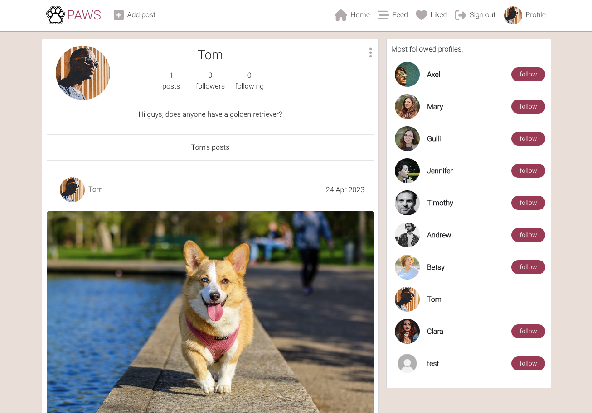

# Paws

Paws is a photo-sharing social networking service on which users can interact with each other by following other users and commenting on or liking their posts. This app is aimed at dog owners, and users are encouraged to share dog-related content. 

## Quick links

[Deployed app](https://paws-frontend.herokuapp.com/)

[Backend repository](https://github.com/axelzwaans/paws-backend)

[Backend deployed](https://paws-backend-api.herokuapp.com/)

# UX

## User stories

Before starting this project, I thought about how this software application might provide value to a user. Using agile methodology, I identified a set of user stories and used GitHub projects to document them. I tagged them either as 'must have' (this is functionality which my app has) or 'could have' (functionality which my app doesn't have, but would be a good feature.)

You can view the user stories in Github projects [here](https://github.com/axelzwaans/paws/issues)

### General, colour, font

This app has been styled using React Bootstrap. The colour scheme was inspired by a cool colour palette I found which matched the type of style I wanted for this project. I kept the design very simple, focusing on functionality and user-friendliness. I used 'Roboto' as the main font in the app because of its simple and elegant style. I chose 'Sans-Serif' as a backup in case the primary font is unable to load.

### Wireframes

I created a low-fidelity wireframe using Balsamiq to help me design my app. I created a mock-up of each page;

**Sign in page**

**Home page**

**Post detail**

**Profile page**

**Create post**

### Entity Relationship Model

I added a graphical representation in the form of an entity-relationship model to depict the relationship between entities within my models. I used Lucidchart to design it.

## Features

I set out to create a simple app that anyone can engage in, providing an easy way for people with dogs to share pictures of their pets. I wanted this app to be a little more than just a platform for uploading pictures so I included functionality which allows users to interact with each other on a basic level, similar to a social media app.

### Existing features

- **Nav bar** - My app has a responsive nav bar which allows the user to seamlessly navigate between pages. The nav bar will show appropriate navigation options depending on whether the user is authenticated. It also includes a logo which links the user back to the landing page from any page. Going by Bootstrap's 'mobile first' approach, the navbar menu automatically renders as collapsed on smaller screen sizes, and can be toggled by a hamburger button.

- **Home page** - The home page can also be referred to as the posts list page, as it will display posts to both logged-in and logged-out users. This page has several components; A search bar, a posts list, and popular profiles list.

- **Post detail page** - When a user clicks on a post from the posts list page, they will be brought to that post's detail page, where they can inspect it in further detail and leave a comment. If the user is the post owner, they can edit or delete their post.

- **Post edit page** - This page allows the user to update an existing post. 

- **Profile page** - The profile page displays more information about the profile, including the number of posts, followers, and followings. From here, the profile owner has access to links to edit their profile, change their username, and change their password. All of the profile's posts are also listed.

- **Profile edit page** - From here, the profile owner can update their profile image and bio. 

- **Feed page** - The feed page is very similar to the posts list page, except that it only includes posts from profiles that the user follows. 

- **Liked page** - This page is also similar in that it contains all posts which the user has liked.

## Testing

### Lighthouse testing

I ran Lighthouse tests on Chrome to check the performance, quality, and correctness of this web app. I generated reports for mobile and desktop devices, which gave the following results;

**Desktop**

**Mobile**

### CSS testing

I used the W3C CSS validation service to check for errors and warnings and received the following report:

### JavaScript testing

I ran all Javascript files included in this project through ESLint; a tool for identifying and reporting on patterns found in ECMAScript/JavaScript code, intending to make code more consistent and avoid bugs. After making a few minor changes in some files, there were no errors. 

### Manual testing

| Function| Test case | Result |                                                          
|---------|-----------|--------|
| Authentication | Sign up | Pass
| Authentication | Sign in | Pass
| Authentication | Set the access tokens to refresh and avoid logout of users | Pass
| Navigation | Access the navbar on every page | Pass
| Navigation | Infinite scroll | Pass
| Navigation | Use keywords in the search bar to find specific posts | Pass
| Posts | View all posts | Pass
| Posts | View post detail | Pass
| Posts | Edit my post | Pass
| Posts | Delete my post | Pass
| Likes | Like a post | Pass
| Likes | Unlike a post | Pass
| Comments | View comments | Pass
| Comments | Comment on a post | Pass
| Comments | Edit my comment | Pass
| Comments | Delete my comment | Pass
| Profiles | View most followed profiles | Pass
| Profiles | Follow a profile | Pass
| Profiles | Unfollow a profile | Pass
| Profiles | View profile detail | Pass

## Deployment

I deployed this app on Heroku, which is a cloud application platform for developers to build, run, and operate their applications. These are the steps taken to deploy:

1. Go to [Heroku](heroku.com) and log into my account.
2. Click the 'new' dropdown menu and select 'Create new app'.
3. Choose an app name, select my region, and click 'Create app'.
4. Go to the deploy tab and connect the app to my app repository. 
5. Enable automatic deploys so I can keep track of my app's deployed status.
6. Click 'Deploy Branch'.
7. If the build is successful, open the app. 

## Credits

### Content

- [Balsamiq](https://balsamiq.com) for wireframes.
- [Lucidchart](https://www.lucidchart.com) for entity relationship model.
- [StackOverflow](https://stackoverflow.com) for help with code-related issues.
- [React Bootstrap](https://react-bootstrap.github.io/) for app layout and components.
- [Heroku](https://dashboard.heroku.com/apps) for cloud platform.
- [Code Institute](https://learn.codeinstitute.net) for their 'Moments' walkthrough app on which I based this project.

### Media

- [Google Fonts](https://fonts.google.com/knowledge) for the 'Roboto' font.
- [Font Awesome](https://fontawesome.com/) for the icons.
- [Pexels.com](https://www.pexels.com/) for the placeholder post and profile images.